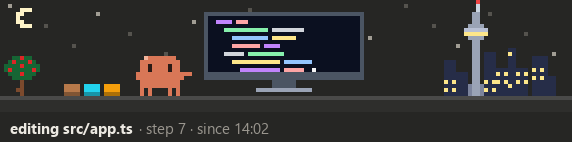
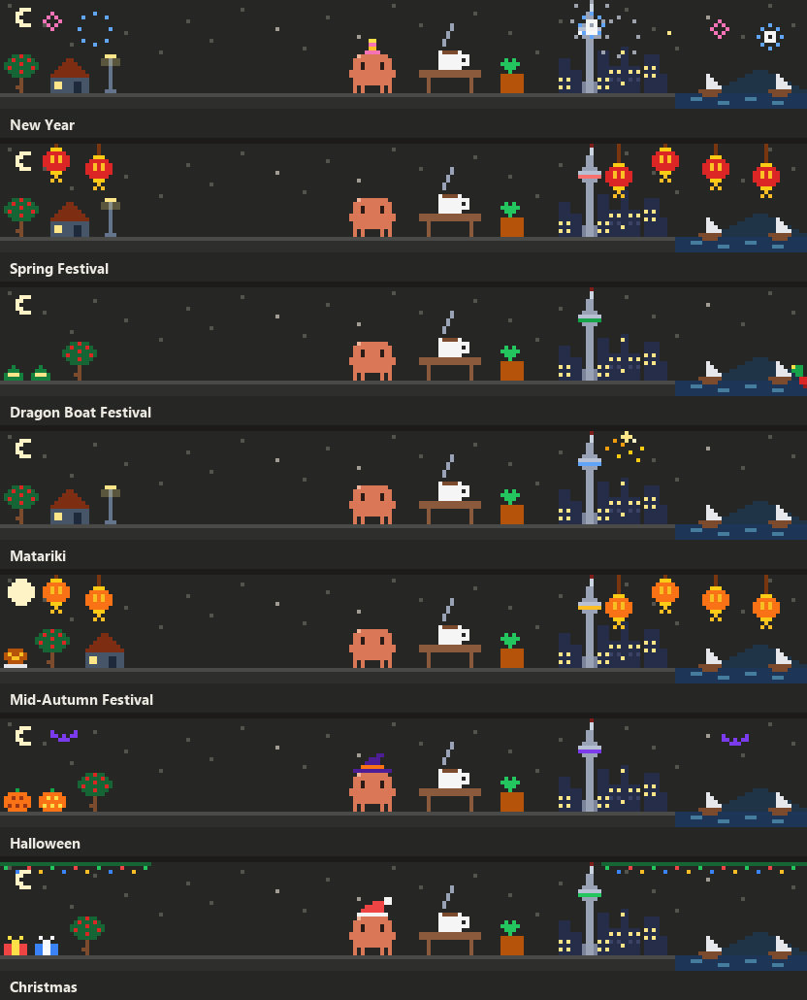

# pixel-at-work

<p>
  <a href="README.md"></a>
  <a href="README.zh-CN.md"></a>
</p>

A pixel-art band above the Claude Code prompt that shows what Claude is doing right now: editing, searching, running tests, building, pushing, querying a database, moving containers, thinking. Old computer-science jokes ride on the spinner, and on holidays the band dresses up.



## What it shows

| When Claude... | the little orange creature... |
|---|---|
| reads or searches | reads a book, or sweeps a magnifying glass over the files |
| edits code, writes docs or LaTeX | types at a screen, or writes on paper |
| runs tests (pytest, jest, cargo test, go test, npm test, ...) | watches test tubes bubble while a checklist fills; a party if they pass, a bug hunt if not |
| builds (make, cargo build, tsc, gradle, npm run build, ...) | runs a conveyor belt and a press; it catches fire if the build fails |
| installs packages (npm, pip, uv, cargo, brew, winget, ...) | catches parcels coming down on parachutes |
| uses git | stamps a commit, sends a push to the cloud, pulls a parcel down, grows a commit graph |
| runs ssh, scp, rsync | carries letters and parcels to a server rack |
| queries a database (psql, sqlite3, mysql, duckdb, ...) | pulls rows out of a database into a table |
| runs docker, podman, kubectl | watches a whale swim by with its containers |
| plans (to-do lists, plan mode) | moves notes across a kanban board |
| asks you a question | holds up a question mark |
| has a call refused | walks into a barrier |
| compacts the context | squeezes a pile of pages into a cube |
| sends a job to the background | goes fishing |
| sends a helper agent | throws papers to a robot; further running calls show up as small helpers at the right |
| thinks | lights a bulb, paces, explains it to a rubber duck, or fills a blackboard, matched to the joke on the spinner |
| waits for you | drinks coffee by day, sleeps at night, stands in the rain if the last turn ended on an API error |

Finished calls pile up as crates at the left, a red one for each failure. The right of the band is Auckland: the Sky Tower, the city lights, the harbour and Rangitoto.

### Holidays



New Year, Spring Festival (from its eve to the Lantern Festival), Dragon Boat Festival, Matariki, Mid-Autumn Festival, Halloween and Christmas, each with its own decorations, a hat for the creature on some, and the Sky Tower lit in the day's colours. Lunar dates and Matariki are tabled up to 2035. Preview one on any day with `/at-work holiday christmas`; `/at-work holiday auto` goes back to the calendar.

## Install

You need a Claude Code build that runs plugin hooks modules (tested with 2.1.286). The pixel art is drawn in the desktop app's Code tab; a terminal session gets a one-line animation instead.

### From the marketplace

```bash
claude plugin marketplace add zhuoxingzhang/pixel-at-work
claude plugin install at-work@pixel-at-work
```

or, inside Claude Code, `/plugin marketplace add zhuoxingzhang/pixel-at-work` and then `/plugin install at-work@pixel-at-work`. The band appears in the next session.

### From a clone

```bash
git clone https://github.com/zhuoxingzhang/pixel-at-work ~/.claude/mods/at-work
```

and point `~/.claude/settings.json` at it with an absolute path (on Windows, for example, `C:/Users/you/.claude/mods/at-work`):

```json
{
  "env": {
    "CLAUDE_CODE_PLUGIN_DIRS": "/home/you/.claude/mods/at-work"
  }
}
```

For a single session, `claude --plugin-dir ~/.claude/mods/at-work` does the same. Use one way only: two copies would both draw.

### If nothing shows up

Hooks modules may be switched off for your account. Turn them on in the `env` block of `~/.claude/settings.json`:

```json
{
  "env": {
    "CLAUDE_CODE_ENABLE_FUNCTION_HOOKS": "1"
  }
}
```

## Settings and commands

| | |
|---|---|
| `language` | `auto` (the default) follows the language of your latest prompt and remembers it across sessions; `zh` is Chinese, `en` is English. Set it with `/plugin configure at-work@pixel-at-work`, with `claude plugin install at-work@pixel-at-work --config language=en`, or, for a clone, with `"pluginConfigs": { "at-work": { "options": { "language": "en" } } }` in `~/.claude/settings.json`. |
| `/at-work holiday <name>` | previews a holiday: `newyear`, `spring`, `dragon`, `matariki`, `moon`, `halloween`, `christmas`; `auto` goes back to the calendar, no name lists them. |
| `/at-work image` or `/at-work frame` | how the desktop draws the picture: as an image (the default, which never blinks) or in a frame (a fallback). |

## How it works

One hooks module (`hooks/register.tsx`). It watches tool calls to pick a scene and passes every call on unchanged. On the desktop each scene is an SVG animated by SMIL, so nothing is redrawn frame by frame: the picture changes only when the scene or the width does. A failed build, a failed call, a passed test, a refused call and a finished compaction hold the band for a few seconds; a call that just ended keeps its scene a moment, so quick calls do not flicker through thinking. A label too long for its row wraps onto a second one rather than ending in an ellipsis.

Nothing leaves your machine: the plugin makes no network requests and stores only the detected language.

## Development

```bash
claude plugin validate .
claude plugin test .
```

The tests are in `tests/`. The API typings an editor needs are generated by Claude Code (`/plugin-types`); git ignores them, along with `tsconfig.json`.

## License

[MIT](LICENSE)
