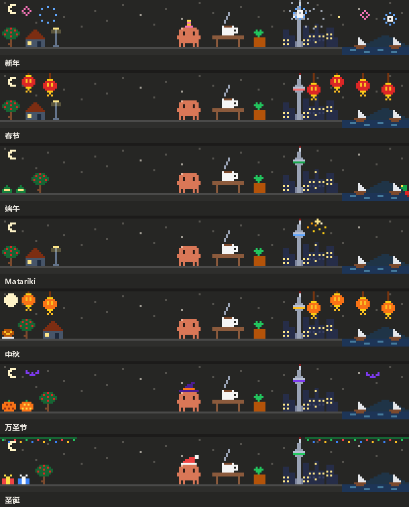

# pixel-at-work

<p>
  <a href="README.md"></a>
  <a href="README.zh-CN.md"></a>
</p>

在 Claude Code 输入框上方放一条像素风动画，实时显示 Claude 正在做什么：改代码、搜索、跑测试、构建、推送、查数据库、搬集装箱、思考……思考时，加载提示里会冒出计算机科学的老梗；逢年过节，整条动画还会换上节日装饰。

<p align="center">
  
</p>

## 都有哪些场景

| Claude 在…… | 橙色小怪兽就…… |
|---|---|
| 读文件或搜索 | 看书，或者拿放大镜扫过一排文件 |
| 改代码、写文档或 LaTeX | 对着屏幕打字，或者在纸上写 |
| 跑测试（pytest、jest、cargo test、go test、npm test 等） | 看试管冒泡，清单一格格打勾；通过了放彩带，没过就抓虫 |
| 构建（make、cargo build、tsc、gradle、npm run build 等） | 开动传送带和压机；构建失败时着火 |
| 装依赖（npm、pip、uv、cargo、brew、winget 等） | 接住挂着降落伞落下来的包裹 |
| 用 git | 盖章提交、把推送送上云端、从云端拉下包裹、长出一棵提交树 |
| 跑 ssh、scp、rsync | 往服务器机柜送信、送包裹 |
| 查数据库（psql、sqlite3、mysql、duckdb 等） | 把数据一行行从数据库拉进表格 |
| 跑 docker、podman、kubectl | 看鲸鱼背着集装箱游过 |
| 排计划（任务清单、plan 模式） | 把看板上的便签从待办挪到完成 |
| 问你问题 | 举起问号牌 |
| 调用被拒 | 撞上栏杆 |
| 压缩上下文 | 把一摞纸压成方块 |
| 把任务放到后台 | 去钓鱼 |
| 派子代理 | 把文件扔给小机器人；同时在跑的其他调用会变成右边的小帮手 |
| 思考 | 点亮灯泡、来回踱步、跟小黄鸭讲解，或者推一黑板公式，和加载提示里的梗搭配 |
| 等你发话 | 白天喝咖啡，晚上睡觉；上一轮因接口出错停下时，站在雨里 |

做完的每一步都会在左边堆成一个箱子，失败的是红箱子。右边是奥克兰：天空塔、城市灯火、港湾和朗伊托托岛。

### 节日

<p align="center">
  
</p>

新年、春节（除夕到元宵）、端午、Matariki、中秋、万圣节、圣诞，各有自己的装饰，有的还给小怪兽戴帽子，天空塔也会亮起节日的颜色。农历日期和 Matariki 列到 2035 年。任何一天都能用 `/at-work holiday christmas` 这样的命令提前看，`/at-work holiday auto` 回到按日期显示。

## 安装

需要支持插件钩子模块（hooks modules）的 Claude Code，已在 2.1.286 上测试。像素动画在桌面应用的 Code 标签页里显示，终端里则是一行字符动画。

### 从插件市场安装

```bash
claude plugin marketplace add zhuoxingzhang/pixel-at-work
claude plugin install at-work@pixel-at-work
```

也可以在 Claude Code 里输入 `/plugin marketplace add zhuoxingzhang/pixel-at-work`，再输入 `/plugin install at-work@pixel-at-work`。新开一个会话就能看到。

### 从克隆安装

```bash
git clone https://github.com/zhuoxingzhang/pixel-at-work ~/.claude/mods/at-work
```

然后在 `~/.claude/settings.json` 里用绝对路径指向它（Windows 上比如 `C:/Users/you/.claude/mods/at-work`）：

```json
{
  "env": {
    "CLAUDE_CODE_PLUGIN_DIRS": "/home/you/.claude/mods/at-work"
  }
}
```

只想在一个会话里用的话，`claude --plugin-dir ~/.claude/mods/at-work` 效果一样。两种方式只用一种，否则会画出两份。

### 什么都没出现时

你的账号可能默认关闭了钩子模块。在 `~/.claude/settings.json` 的 `env` 里打开它：

```json
{
  "env": {
    "CLAUDE_CODE_ENABLE_FUNCTION_HOOKS": "1"
  }
}
```

## 设置和命令

| | |
|---|---|
| `language` | 默认 `auto`，跟随你最近一条提示的语言，并跨会话记住；`zh` 固定中文，`en` 固定英文。可以用 `/plugin configure at-work@pixel-at-work` 设置，也可以安装时加上 `--config language=en`；克隆安装的，在 `~/.claude/settings.json` 里写 `"pluginConfigs": { "at-work": { "options": { "language": "en" } } }`。 |
| `/at-work holiday <名字>` | 预览节日装饰，名字是 `newyear`、`spring`、`dragon`、`matariki`、`moon`、`halloween`、`christmas`；`auto` 回到按日期，不带名字会列出全部。 |
| `/at-work image` 或 `/at-work frame` | 桌面端的画法：图片（默认，切换不闪）或小窗（备用）。 |

## 工作原理

整个插件是一个钩子模块（`hooks/register.tsx`）。它观察工具调用来挑场景，每个调用都原样放行。桌面端的每个场景是一张用 SMIL 动起来的 SVG，不逐帧重画：只有场景或宽度变了，画面才会换。构建失败、调用失败、测试通过、调用被拒、上下文压缩完成，都会让动画停留几秒；刚结束的调用会多保留一会儿场景，这样很快的调用之间不会闪回思考画面。标签太长时会换到第二行，不会被省略号截掉。

插件不联网，只在本地记住检测到的语言。

## 开发

```bash
claude plugin validate .
claude plugin test .
```

测试在 `tests/` 里。编辑器需要的 API 类型声明由 Claude Code 生成（`/plugin-types`），git 会忽略它们和 `tsconfig.json`。

## 许可证

[MIT](LICENSE)
